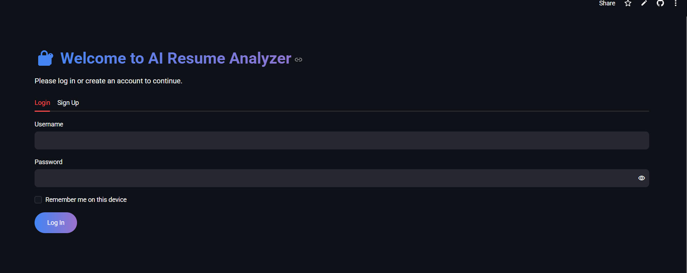
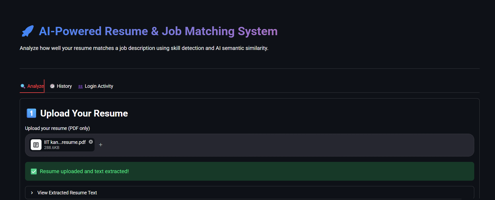
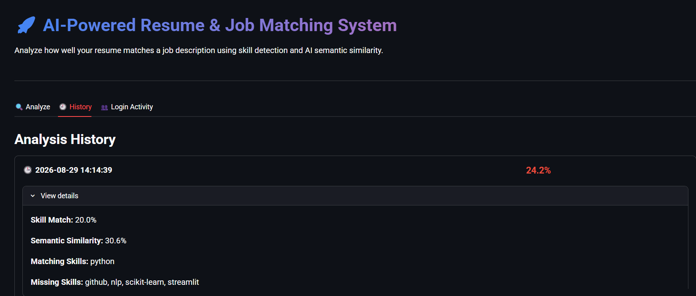

# 📄 AI Resume & Job Matching System

🔗 **Live Demo:** [ai-resume-analyzer-6vruumhrlvxkfazfbxp8op.streamlit.app](https://ai-resume-analyzer-6vruumhrlvxkfazfbxp8op.streamlit.app/)

An AI-powered web application...

## 🎯 Features

- **PDF Resume Parsing** — Upload a resume PDF and extract its text automatically using PyMuPDF
- **Skill Detection** — Identify technical skills from both the resume and job description using keyword matching
- **Skill Matching** — Calculate the percentage of required job skills present in the resume
- **TF-IDF Text Similarity** — Measure overall content overlap using classic NLP techniques (scikit-learn)
- **Semantic AI Similarity** — Use Sentence Transformers to understand the *meaning* of the resume and job description, not just exact word overlap
- **Combined Match Score** — A weighted final score blending skill match and semantic similarity
- **Personalized Recommendations** — Suggestions for missing skills, categorized by type (e.g., Cloud Platform, Database, Machine Learning Library)
- **Resume Improvement Tips** — Basic, honest suggestions based on resume length and structure
- **Analysis History** — All past analyses are saved locally using SQLite and can be reviewed anytime
- **Error Handling** — Gracefully handles invalid PDFs, scanned/image-only documents, and empty inputs

## 🛠️ Tech Stack

| Technology | Purpose |
|---|---|
| Python | Core programming language |
| Streamlit | Web application UI |
| PyMuPDF (fitz) | PDF text extraction |
| scikit-learn | TF-IDF vectorization and cosine similarity |
| Sentence Transformers | Semantic (meaning-based) similarity using pre-trained AI models |
| SQLite | Local persistent storage for analysis history |

## 📸 Screenshots

## 📸 Screenshots

**Login & Sign Up**


**Match Analysis**


**Analysis History**


## 🚀 Installation & Setup

1. **Clone the repository**
```bash
   git clone https://github.com/YOUR_USERNAME/AI-Resume-Analyzer.git
   cd AI-Resume-Analyzer
```

2. **Create and activate a virtual environment**
```bash
   python -m venv venv

   # Windows
   venv\Scripts\activate

   # Mac/Linux
   source venv/bin/activate
```

3. **Install dependencies**
```bash
   pip install -r requirements.txt
```

4. **Run the application**
```bash
   streamlit run app.py
```

5. Open the local URL shown in the terminal (usually `http://localhost:8501`) in your browser.

## 🧠 How It Works

1. **Text Extraction** — The uploaded PDF resume is parsed using PyMuPDF to extract raw text.
2. **Skill Detection** — Both resume and job description text are scanned against a curated list of technical skills using word-boundary-aware keyword matching.
3. **Skill Matching** — The two skill sets are compared to calculate matching and missing skills, and an overall skill match percentage.
4. **TF-IDF Similarity** — The full texts are vectorized using TF-IDF, and cosine similarity measures their word-level overlap.
5. **Semantic Similarity** — Both texts are converted into embeddings using the `all-MiniLM-L6-v2` Sentence Transformer model, and compared using cosine similarity to capture *meaning*, not just word overlap.
6. **Final Score** — A weighted combination (60% skill match, 40% semantic similarity) produces the final match score.
7. **Recommendations** — Missing skills are categorized and paired with general learning suggestions; resume tips are generated from simple structural heuristics.
8. **Storage** — Every analysis is saved to a local SQLite database for future reference.

## 📁 Project Structure

AI-Resume-Analyzer/
├── app.py                 (Main Streamlit application)
├── resume_parser.py       (PDF text extraction logic)
├── skill_extractor.py     (Skill detection and recommendation logic)
├── matcher.py             (Matching algorithms: keyword, TF-IDF, semantic AI)
├── database.py            (SQLite database operations)
├── requirements.txt       (Python dependencies)
├── data/                  (SQLite database storage, not tracked in git)
└── README.md

## ⚠️ Limitations

- Skill detection relies on a predefined keyword list, so it may not detect every possible skill or technology
- Text extraction works best with standard, text-based PDFs — scanned/image-only PDFs are not supported
- Recommendations are general in nature and not a substitute for professional career guidance

## 🔮 Future Improvements

- Expand the skill keyword dictionary
- Support multiple resume formats (DOCX, TXT)
- Add user accounts for personalized history
- Deploy publicly with cloud-hosted persistent storage

## 👤 Author

**Shrihari Duvacherla**
B.Tech CSE (Data Science) Student
[LinkedIn](#) | [GitHub](#)

## 📄 License

This project is open source and available under the MIT License.